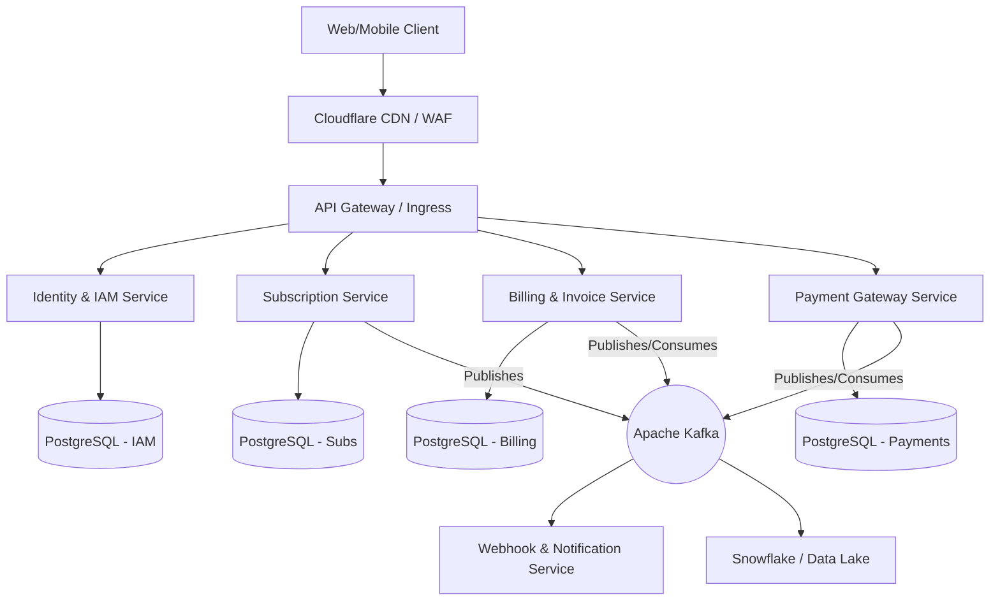

# Complete Enterprise System & Services Design

## 1. Architecture Overview

This architecture is an Event-Driven Microservices pattern deployed on Kubernetes. It decouples core business logic into bounded contexts, allowing independent scaling and preventing cascading failures.



## 2. Microservices Detailed Design

### 2.1 Identity & IAM Service
Handles multi-tenant authentication, API keys, and RBAC.

*   **Tech Stack**: Node.js (NestJS) or Go, PostgreSQL, Redis (Token Blocklisting/Rate Limiting).
*   **Database (ERD)**:
    *   `organizations`: `id`, `name`, `tax_id`, `created_at`
    *   `users`: `id`, `org_id`, `email`, `password_hash`, `role` (Admin, Billing, ReadOnly)
    *   `api_keys`: `id`, `org_id`, `key_hash`, `scopes`, `expires_at`
*   **Core APIs**:
    *   `POST /api/v1/auth/login` (Returns JWT)
    *   `POST /api/v1/auth/api-keys` (Generates scoped API keys)
    *   `GET /api/v1/iam/users`

### 2.2 Subscription Service
The source of truth for the product catalog and customer entitlements.

*   **Tech Stack**: Node.js, PostgreSQL.
*   **Database (ERD)**:
    *   `products`: `id`, `name`, `description`, `active`
    *   `prices`: `id`, `product_id`, `amount`, `currency`, `billing_interval`
    *   `customers`: `id`, `org_id`, `name`, `email`
    *   `subscriptions`: `id`, `customer_id`, `price_id`, `status` (trialing, active, past_due, canceled), `current_period_end`
*   **Core APIs**:
    *   `POST /api/v1/subscriptions`
    *   `POST /api/v1/subscriptions/:id/cancel`
*   **Events Published**: `subscription.created`, `subscription.updated`, `subscription.canceled`

### 2.3 Billing & Invoice Service (Core Engine)
The calculation engine. It handles proration, GST calculation, and PDF generation.

*   **Tech Stack**: Java/Spring Boot (for strict floating-point math & multi-threading) or heavily typed Node.js (TypeScript). PostgreSQL. AWS S3 (PDFs).
*   **Database (ERD)**:
    *   `invoices`: `id`, `customer_id`, `subscription_id`, `subtotal`, `tax`, `total`, `status` (draft, open, paid, void), `pdf_url`
    *   `invoice_line_items`: `id`, `invoice_id`, `description`, `amount`, `tax_rate`
*   **Event Consumption**:
    *   Consumes `subscription.created` → Generates initial prorated `invoice.draft`.
    *   Consumes `payment.succeeded` → Updates invoice status to `paid`.
*   **Core APIs**:
    *   `GET /api/v1/invoices`
    *   `POST /api/v1/invoices/:id/finalize`

### 2.4 Payment Gateway Service
The integration layer for external providers (Razorpay, Stripe).

*   **Tech Stack**: Go (for high-concurrency webhook handling), PostgreSQL.
*   **Database (ERD)**:
    *   `payment_intents`: `id`, `invoice_id`, `provider` (stripe/razorpay), `provider_tx_id`, `status`, `amount`
    *   `refunds`: `id`, `payment_intent_id`, `amount`, `reason`
*   **Webhook Handling**:
    *   `POST /webhooks/stripe` / `POST /webhooks/razorpay`
    *   *Logic*: Verify cryptographic signature → Save raw event to DB → Publish to Kafka → Return `200 OK`. Do NOT process business logic synchronously.

## 3. Event-Driven Schema (Apache Kafka)

All inter-service communication happens via Kafka topics using Avro or Protobuf schemas for strict type safety.

*   **Topic**: `billing.events.subscriptions`
    *   *Payload*: `{ "event_id": "evt_123", "type": "subscription.created", "timestamp": 1715690000, "data": { "sub_id": "sub_abc", "plan_id": "plan_xyz" } }`
*   **Topic**: `billing.events.payments`
    *   *Payload*: `{ "event_id": "evt_456", "type": "payment.succeeded", "data": { "invoice_id": "inv_123", "tx_id": "pay_xyz" } }`

## 4. Infrastructure & DevOps (AWS Setup)

### 4.1 Terraform Directory Layout (IaC)
```text
infrastructure/
├── modules/
│   ├── vpc/             # Network isolation, NAT Gateways
│   ├── eks/             # Kubernetes cluster
│   ├── rds/             # Aurora PostgreSQL clusters
│   ├── msk/             # Managed Streaming for Kafka
│   └── elasticache/     # Redis clusters
├── envs/
│   ├── staging/         # Exact replica of production scaled down
│   └── production/      # High-availability production state
```

### 4.2 Kubernetes (EKS) Topology
*   **Namespaces**: `ingress-nginx`, `billing-services`, `observability`.
*   **Autoscaling**: 
    *   HPA (Horizontal Pod Autoscaler) scales pods based on CPU/Memory.
    *   KEDA (Kubernetes Event-driven Autoscaling) scales Webhook/Notification workers based on Kafka topic lag.

## 5. Security & Compliance Matrix

*   **PCI-DSS**: We will implement Stripe Elements or Razorpay Checkout. Card data goes directly from the user's browser to the payment provider. Our systems only store safe, opaque tokens (e.g., `cus_12345`).
*   **Data Encryption**: 
    *   *In Transit*: mTLS (Mutual TLS) between microservices using Istio Service Mesh.
    *   *At Rest*: AWS KMS managed keys for RDS instances and S3 buckets.
*   **WAF (Web Application Firewall)**: AWS WAF applied at the CloudFront level to block SQL injection, XSS, and geographically block malicious IPs.

## 6. Disaster Recovery & SLOs

*   **RPO (Recovery Point Objective)**: < 5 minutes. Achieved via continuous RDS binlog replication to a standby cross-region cluster.
*   **RTO (Recovery Time Objective)**: < 1 hour. Achieved via fully automated Terraform pipelines that can recreate the entire infrastructure in a secondary AWS region if `ap-south-1` (Mumbai) goes down.
