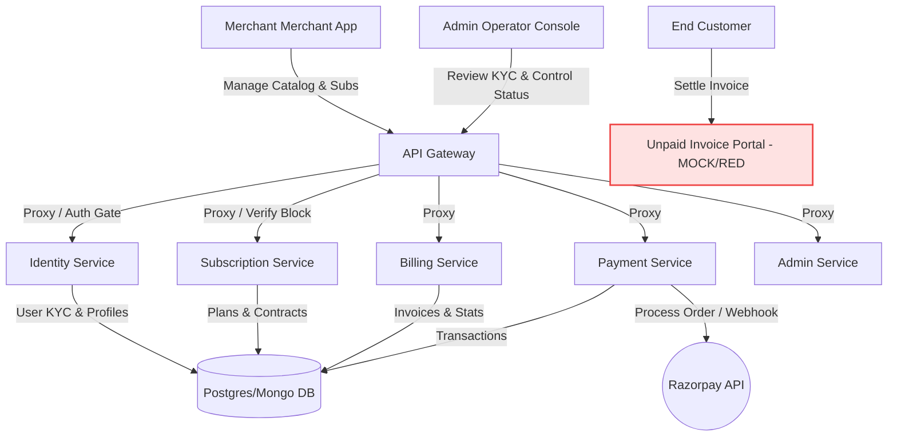
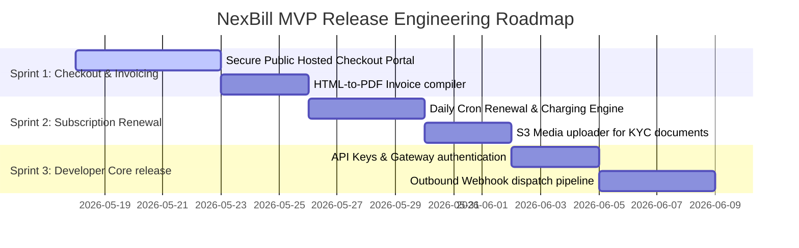

# NexBill: Deep Feature Analysis & Strategic MVP Release Roadmap

This report provides a highly granular, system-wide analysis of the **NexBill Platform** (a Stripe-like subscription and billing processor). It cross-references the current implementation across all **Frontend App Page components**, the **Admin Console (Backoffice)**, and the **Microservices (Backend)** to identify exactly what has been completed, what is partially built, and the exact engineering delta required to release a production-ready Minimum Viable Product (MVP).

---

## 1. Executive Summary & Architecture Overview

NexBill is architected as an **Event-Driven Microservices Monorepo** modeled after Stripe's core infrastructure. Instead of integrating Stripe, NexBill *emulates* Stripe by acting as the payment processor, merchant KYC platform, and subscription billing engine.

### System Architecture Flow & Gaps

---

## 2. Granular Service-by-Service Feature Matrix

Below is the state of the codebase, detailing completed elements vs. missing parts.

### A. Merchant Accounts & KYC Onboarding (Identity Service)
This subsystem handles merchant registration, secure login, and the robust enterprise KYC flow needed to activate a processor account.

*   **Status**: 🟠 **75% Completed (Onboarding logic & Gatekeeper verify are done; Document Storage is missing)**.
*   **Existing Files**:
    *   Frontend: [Register.jsx](file:///Users/gokul/Desktop/code/NexBill/frontend/src/pages/Register.jsx), [Login.jsx](file:///Users/gokul/Desktop/code/NexBill/frontend/src/pages/Login.jsx), [ActivateAccount.jsx](file:///Users/gokul/Desktop/code/NexBill/frontend/src/pages/ActivateAccount.jsx)
    *   Backend: [auth.service.js](file:///Users/gokul/Desktop/code/NexBill/services/identity-service/src/services/auth.service.js), [auth.middleware.js](file:///Users/gokul/Desktop/code/NexBill/services/api-gateway/src/middlewares/auth.middleware.js)
*   **What is Completed**:
    *   🟢 **Onboarding Form**: Beautiful UI in [ActivateAccount.jsx](file:///Users/gokul/Desktop/code/NexBill/frontend/src/pages/ActivateAccount.jsx) capturing complex merchant details (Business entity type, Business PAN, GSTIN, Bank details, beneficial owners, and signature terms).
    *   🟢 **State Reconciliation**: Identity service updates `identity.users` and a separate `identity.merchant_activations` record.
    *   🟢 **Centralized Gateway Enforcement**: The [auth.middleware.js](file:///Users/gokul/Desktop/code/NexBill/services/api-gateway/src/middlewares/auth.middleware.js) intercepts every call, dynamically requesting the merchant's block/verification status from the `identity-service`. If a merchant is blocked by admins, the gateway rejects all mutation calls (POST, PUT, DELETE) with a `403 Forbidden` response.
*   **MVP Release Delta (What is Needed)**:
    *   🔴 **Secure Document Storage**: The KYC form allows merchants to submit documents, but there is no file hosting backend (e.g. AWS S3/MinIO Integration) to process and store actual images/PDFs of PAN, Aadhaar, or Bank statements.
    *   🔴 **Email Verification Flow**: Missing a registration activation check (sending an OTP or cryptographic token link) before allowing merchants access to their workspace.

---

### B. Customer & Contact Directory (Identity Service)
Merchants must be able to manage their downstream customers to charge them for subscription cycles.

*   **Status**: 🟢 **90% Completed (Standard CRUD & UI are ready)**.
*   **Existing Files**:
    *   Frontend: [Customers.jsx](file:///Users/gokul/Desktop/code/NexBill/frontend/src/pages/Customer/Customers.jsx), [CustomerDetails.jsx](file:///Users/gokul/Desktop/code/NexBill/frontend/src/pages/Customer/CustomerDetails.jsx)
    *   Backend: [customer.routes.js](file:///Users/gokul/Desktop/code/NexBill/services/identity-service/src/routes/customer.routes.js)
*   **What is Completed**:
    *   🟢 **Merchant Dashboard UI**: View listings, search, and click to inspect individual customer metrics.
    *   🟢 **Backend Directory API**: Customer registration is complete and can be fetched via Gateway/Identity endpoint.
*   **MVP Release Delta (What is Needed)**:
    *   🔴 **Payment Method Vaulting**: In a true Stripe-like setup, a Customer object should securely hold a payment method token (e.g., Razorpay tokenized card ID) to facilitate automated recurring renewals. Currently, a customer is just a simple contact record.

---

### C. Product Catalog & Pricing Plans (Subscription Service)
Enables merchants to configure their plans (pricing models, rates, features) to build their subscription models.

*   **Status**: 🟢 **90% Completed (Core Flat-Rate Plan CRUD is fully operational)**.
*   **Existing Files**:
    *   Frontend: [Plans.jsx](file:///Users/gokul/Desktop/code/NexBill/frontend/src/pages/Plans.jsx)
    *   Backend: [plan.routes.js](file:///Users/gokul/Desktop/code/NexBill/services/subscription-service/src/routes/plan.routes.js)
*   **What is Completed**:
    *   🟢 **Plan Builder UI**: Create manual plans with pricing details, billing cycle (monthly/yearly), and custom feature tags.
    *   🟢 **Catalog Schema**: DB schemas mapped to `subscription.plans` storing decimal pricing details.
*   **MVP Release Delta (What is Needed)**:
    *   🔴 **Product-Price Separation**: A true payment processor separates *Products* (the item sold) from *Prices* (multiple prices/currencies for that product). NexBill currently uses a single `Plan` model that bundles both, which limits merchant pricing flexibility (e.g. charging $10/mo OR $100/yr for the exact same service).
    *   🔴 **Advanced Billing Models**: Metered usage billing (e.g. API count ingestion) and tiered pricing are missing.

---

### D. Subscription Lifecycle Engine (Subscription Service)
Coordinates customer billing contracts and handles active subscription renewals.

*   **Status**: 🟠 **60% Completed (Creation/Cancellation exists, Cron engine is missing)**.
*   **Existing Files**:
    *   Frontend: [Subscriptions.jsx](file:///Users/gokul/Desktop/code/NexBill/frontend/src/pages/Subscriptions.jsx)
    *   Backend: [subscription.service.js](file:///Users/gokul/Desktop/code/NexBill/services/subscription-service/src/services/subscription.service.js)
*   **What is Completed**:
    *   🟢 **Merchant Subscriptions UI**: Listing table with plans, customer name mappings, active statuses, and next billing date displays.
    *   🟢 **Manual Subscriptions CRUD**: Create subscriptions, calculate the 30-day next-billing cycle date, and cancel active subscriptions immediately.
    *   🟢 **Inter-Service Invoice Triggering**: Creating a subscription automatically makes an HTTP post request to [billing.service.js](file:///Users/gokul/Desktop/code/NexBill/services/billing-service/src/services/billing.service.js) to generate an initial, unpaid invoice.
*   **MVP Release Delta (What is Needed)**:
    *   🔴 **Recurring Renewal Engine (Cron Job)**: No cron or scheduled task daemon exists to scan the DB daily for subscriptions that reached their `next_billing_date`, automatically charge the customer's vaulted payment card, and roll the billing date forward.
    *   🔴 **Mid-Cycle Proration Engine**: If a user switches their plan mid-cycle, there is no calculation to credit unused days.

---

### E. Invoicing & Billing calculation (Billing Service)
Computes financial amounts, tracks due invoices, and aggregates revenue stats for the merchant.

*   **Status**: 🟠 **50% Completed (Invoice logging & stats are done; Hosted payment page & PDF downloads are missing)**.
*   **Existing Files**:
    *   Frontend: [Invoices.jsx](file:///Users/gokul/Desktop/code/NexBill/frontend/src/pages/Invoices.jsx)
    *   Backend: [billing.service.js](file:///Users/gokul/Desktop/code/NexBill/services/billing-service/src/services/billing.service.js)
*   **What is Completed**:
    *   🟢 **Invoice Registry**: Beautiful tabular view displaying invoice IDs (formatted e.g. `#00001`), customer names, dates, amounts, and paid/unpaid indicators.
    *   🟢 **MRR & Status Statistics**: Robust dashboard metrics aggregating Total MRR and Pending Invoice counts.
*   **MVP Release Delta (What is Needed)**:
    *   🔴 **Hosted Invoice Checkout Page**: **This is the biggest MVP blocker.** Unpaid invoices must generate a unique, public, secure hosted checkout page URL (e.g., `https://checkout.nexbill.com/pay/inv_123`). The end-customer visits this URL to complete the payment via Razorpay.
    *   🔴 **PDF Invoice Compiler**: The download invoice icon is a frontend mock. An HTML-to-PDF compiler (such as `pdfkit`) must be added to build legal, tax-compliant PDF downloads for customers.

---

### F. Payment Processing & adaptors (Payment Service)
Processes actual financial transactions using integrated gate endpoints.

*   **Status**: 🟠 **70% Completed (Razorpay order creation & secure webhooks are complete; Checkout UI is missing)**.
*   **Existing Files**:
    *   Backend: [payment.service.js](file:///Users/gokul/Desktop/code/NexBill/services/payment-service/src/services/payment.service.js), [payment.controller.js](file:///Users/gokul/Desktop/code/NexBill/services/payment-service/src/controllers/payment.controller.js)
*   **What is Completed**:
    *   🟢 **Order Inception**: Creates transaction records in the DB, converts currency into paise, and interfaces with the official Razorpay SDK to spawn orders.
    *   🟢 **Secure Webhook Verification**: Cryptographic signature validation verifies incoming webhooks from Razorpay and captures payments safely.
    *   🟢 **Processor-Level Fraud Blocking**: Gateway/Payment controller blocks live transaction creation if the merchant workspace is locked.
*   **MVP Release Delta (What is Needed)**:
    *   🔴 **Interactive Checkout UI Component**: An SDK-like modal (like Stripe Checkout or Stripe Elements) to open the Razorpay payment window when checking out an invoice.
    *   🔴 **Refund Trigger Handler**: Missing dashboard hooks and routes to issue partial or full refunds.

---

### G. Administrative Backoffice Operations (Admin Service)
Allows NexBill site owners to govern the entire merchant user base, evaluate KYC records, and manage tenant health.

*   **Status**: 🟢 **95% Completed (Backoffice dashboard and merchant inspection is fully operational)**.
*   **Existing Files**:
    *   Frontend: [Dashboard.jsx](file:///Users/gokul/Desktop/code/NexBill/nexbill-console/src/pages/Dashboard.jsx)
    *   Backend: [admin.service.js](file:///Users/gokul/Desktop/code/NexBill/services/admin-service/src/services/admin.service.js)
*   **What is Completed**:
    *   🟢 **Merchant Verification Queue**: Admin console renders an activation request list holding unprocessed onboardings.
    *   🟢 **Merchant Inspector Panel**: Beautiful UI showing merchant details (PAN, address, legal name).
    *   🟢 **Admin Control Panel**: Interactive form to verify, request updates (`action_required`), toggle charges/payouts flags, add comments, block merchants, and broadcast custom banner announcements.
*   **MVP Release Delta (What is Needed)**:
    *   🟢 **Essentially Complete**: Ready for release out-of-the-box.

---

### H. API Keys, Developer Tools, & Outbound Webhooks
To build a developer-first platform like Stripe, NexBill must provide API keys and dispatch webhook events back to merchants when transactions occur.

*   **Status**: 🔴 **10% Completed (Conceptual architecture only)**.
*   **Existing Files**:
    *   Architecture: [enterprise_system_design.md](file:///Users/gokul/Desktop/code/NexBill/enterprise_system_design.md)
*   **What is Completed**:
    *   🟢 **Database Schemas**: PostgreSQL schemas are fully defined to support organizations, user scoping, and scoped hash-validated API keys.
*   **MVP Release Delta (What is Needed)**:
    *   🔴 **API Key Developer Portal**: A UI tab in workspace settings where a merchant can generate, view (one-time socket reveal), and roll their `pk_live` / `sk_live` API keys.
    *   🔴 **API Key Gateway Auth**: API Gateway must accept and authenticate requests containing an `X-API-Key` or `Authorization: Bearer sk_...` header.
    *   🔴 **Outbound Webhook Dispatcher**: An outbound worker service (e.g. redis-backed queue) that POSTs payload events (like `invoice.paid` or `subscription.cancelled`) to a merchant's designated listener URL.

---

## 3. High-Level Summary Matrix

| Platform Subsystem | Tech Focus | Status | MVP Release Priority |
| :--- | :--- | :--- | :--- |
| **Merchant KYC & Auth** | JWT, Onboarding, Gate blocking | 🟠 75% | **Medium** (Needs S3 document upload) |
| **Customer Directory** | Standard CRUD, HTTP linkages | 🟢 90% | **Low** (Ready, needs token vaulting later) |
| **Pricing plans catalog** | Flat-rate cycles, features DB | 🟢 90% | **Low** (Separating Product-Prices is optional for MVP) |
| **Subscription Lifecycle** | Triggered invoicing, cancellation | 🟠 60% | **High** (Needs daily cron renewal daemon) |
| **Invoices & Billing** | Stats, MRR dashboard, lists | 🟠 50% | **Critical** (Needs secure public hosted pay portal) |
| **Payment adaptor** | Razorpay SDK, Secure Webhook | 🟠 70% | **Critical** (Needs checkout UI integration & refunds) |
| **Admin Backoffice** | Verification panel, KYC inspector | 🟢 95% | **Complete** (Production-ready) |
| **Developer API & Webhooks** | API keys, outbound dispatcher | 🔴 10% | **High** (Essential to be a developer-first platform) |

---

## 4. Technical Roadmap to MVP Launch

To launch the NexBill MVP, we recommend executing the remaining engineering tasks in these three targeted sprints:

### Sprint 1: Invoicing & Checkout Portal (The "Checkout Pipeline")
1. **Hosted Checkout Page**: Spin up a minimal customer-facing payment screen that parses invoice IDs from the URL, calls payment-service `/create-order`, and renders the Razorpay checkout button.
2. **HTML-to-PDF Compile**: Add a simple microservice endpoint or library (`pdfkit`) to stream invoices as downloadable PDFs on [Invoices.jsx](file:///Users/gokul/Desktop/code/NexBill/frontend/src/pages/Invoices.jsx).

### Sprint 2: Subscription Automation & Document Storage
1. **Daily Renewal Engine**: Build a lightweight cron task in `subscription-service` that queries active subscriptions whose `next_billing_date` is today, automatically registers an invoice, and triggers the transaction payment.
2. **Media Uploader**: Connect S3 or local disk storage hooks to the [ActivateAccount.jsx](file:///Users/gokul/Desktop/code/NexBill/frontend/src/pages/ActivateAccount.jsx) onboarding screen to upload identity documents.

### Sprint 3: Developer Core release
1. **API Keys**: Add a Developer tab in [WorkspaceSettings.jsx](file:///Users/gokul/Desktop/code/NexBill/frontend/src/pages/Settings/WorkspaceSettings.jsx) allowing merchants to manage secrets. Add the key authentication middleware to `api-gateway`.
2. **Outbound Dispatcher**: Set up a simple event emitter queue to POST payloads to merchant webhooks.

---

> [!NOTE]
> NexBill's core architecture, including its event-driven structures, secure admin backoffice verification dashboards, gateway fraud-blocking, and Razorpay integration, is **remarkably robust and well-designed**. The platform is in an excellent position, requiring only localized feature integrations (checkout portal, cron renewals, and file uploads) to be fully ready for production deployment.
